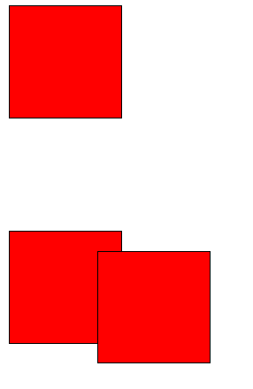

# 定位

# 学习目的

- css 布局的三种机制 
- 为什么使用定位
- 定位的四种分类
- 四种定位各自的特点
- 我们为什么经常使用子绝父相布局
- 输出：做完小米的轮播图

# css 布局三种机制

> 网页布局的核心 -- 就是用 css 来摆放盒子的位置

css 提供了三种机制来摆放盒子的位置
- 标准流(标准流) 

一个网页中的标签按照 **从上到下，从左到右** 的顺序排列
    - 块元素独占一行，从上到下排列
    - 行内元素会按照顺序从左到右排列

- 浮动

让盒子从普通流中 **浮** 起来 -- 让多个盒子 水平排成一列

- 定位 

将盒子定在某一个位置，漂浮在其他盒子的上面 -- CSS 离不开定位，特别是后面的 JS 特效

# 定位（position）

**概念** 定位是使用 定位模式 + 偏移的方式 将盒子定在某一位置

定位的效果：比如商品的一些 HOT 或者 价格标签 会基于 商品的图片进行定位 网站的轮播图的箭头会基于图片进行定位
这样使得网站在交互效果上 更加友好

例子


上面的这些效果如果想要使用浮动来做的话 还需要 用 margin 控制 距离某一个边距的距离
所以用浮动或者是标准流去控制 margin 的 方式还是比较麻烦的

所以有了 **浮动**

## 语法

> 定位的概念：定位 = 定位的模式 + 边偏移

## 边偏移

在 CSS 中可以 通过 top bottom left right 等 方位名词来定义元素的 **边偏移**
边偏移就是指的元素距离某一个边的距离
|边偏移属性|Demo|解释|
|---|---|---|
|top|top：20px|顶端偏移量，元素距离上面是20px|
|bottom|bottom：20px|底部偏移量，定义元素距离父元素下边框的距离|
|left|left：20px|左侧偏移量，定义元素距离父元素左边边框的距离|
|right|right：20px|右侧偏移量，定义元素距离父元素右边边框的距离|

**注意**
- **边偏移**需要和**定位模式**一起使用，单独使用无效
- top 和 bottom 不要一起使用
- left 和 right 不能一起使用

## 定位的模式

在 CSS 中通过 position 属性来定义元素的 **定位模式** 语法如下

```css
.son {
    position:absolute
}
```
全部的属性值和解释如下表
|属性值|语义|关键词|描述|
|---|---|---|---|
|static|静态定位|不定位|所有元素默认的定位方式|
|relative|相对定位|自恋|相对于其 标准流的 位置进行定位|
|absolute|绝对定位|拼爹|相对于上一个已经定位的元素进行定位|
|fixed|固定定位|浏览器|一般用于做导航栏，相对于浏览器窗口进行定位|

## 定位模式之间的区别

### 1. 静态定位（static）

相对定位是元素的默认的定位方式，也就是说网页中的所有元素 都是默认静态 定位的 按照标注流的特性摆放位置

> 也就是说 **不需要定位的元元素，他的定位属性就是static**

**注意** 

在 静态定位的情况下无法通过 边偏移的属性来改变元素的位置

因为是默认值，所以在静态布局的时候是不需要写的，但是 需要知道的是元素的定位属性有四种

### 2. 相对定位 (relative)

相对定位是元素相对于他自身在标准流里面的位置 通过边偏移的属性来设置元素的位置的。
也就是说相对于自身原来的位置进行偏移 所以称之为 **自恋型**

**相对定位的特点**
- 在自己原来的标准流的位置上进行位置上的偏移 来定位新的元素的位置
- 定位之后的元素还占据着原来的位置，后面的元素也不能顶上来 占上他的位置
- 原来的位置继续占有，有的人死了，他还活着，人走了，屁的臭味还在
**相对定位Demo效果**


和**浮动**的对比
- 浮动--多个块级元素一行显示，脱离标准流
- 相对定位- 让盒子移动到我们想要的位置不脱标
- 
### 3.绝对定位（拼爹型） --> 相对于 上一级 有定位的父元素
**绝对定位** 有两个非常重要的概念
- 完全脱标 -- 完全不占位置--使用绝对定位会使得元素下面的盒子挤上去
- 父元素都要有定位父亲在标准流的位置 + 边偏移属性 来设置元素的位置
    - 如果当前元素没有定位 则寻找上一级有定位的父元素
    - 如果所有的父元素都没有定位，则以 Ducument 文档 为准定位
    - 如果父亲有定位，则以父亲为准

总而言之，这个绝对定位 就是在 **认爹** 找到一个爹就 OK 了 ，但是这个爹 需要有定位。

### 子绝父相 及其 原因分析
想当初在学习定位的时候,别的没记住 就记住 **子绝父相**了
> 子级是 绝对定位 父级是相对定位 谁是 儿子谁就是 a(absolute) 父亲就是r (relative)

**为什么**?

分析下 轮播图的情形就知道了,箭头在其他图片的上面就应该使用绝对定位,因为绝对定位完全脱标,不占位置。
那么父级盒子，需不需要占据位置呢？当然需要了，如果不需要占据位置，那么图片下方的
分析下 轮播图的情形就知道了,箭头在其他图片的上面就应该使用绝对定位,因为绝对定位完全脱标,不占位置。
那么父级盒子，需不需要占据位置呢？当然需要了，如果不需要占据位置，那么图片下方的其他元素就会跑到上面来 所以使用相对定位，所以 父级盒子占据位置就需要相对定位，子盒子任意位置就需要绝对定位 这就是 **原因**

### 4. 固定定位（fixed）
固定定位是绝对定位一种特殊形式（认死理型）

- 完全脱标--完全不占位置
- 以浏览器的窗口为参考系--浏览器可视窗口 + 边偏移属性来设置元素的位置
  - 跟父元素没有任何关系
  - 不随着滚动条滚动
  - IE 6 等低版本浏览器不支持固定定位

## 定位的扩展

### 1. 绝对定位的盒子居中
> 注意：绝对定位不能 通过 margin：auto  设置水平居中
- 方案1 **相对定位**
1. 记住一点 相对定位是基于之前他在标准流里面的位置进行的边偏移 他之前就应该在盒子的左上角 所以使用相对定位是可以的
2. 设置偏移：left：50% 让各自的左侧移动到父级元素的的水平中心位置
3. margin-left：-100px 让盒子向左移动自身宽度的一半


### 2. 堆叠顺序

我们在使用 定位 布局时，可能会出现盒子重叠的情况。应用 z-index 层叠等级属性可以调整盒子的堆叠顺序
1. 属性值：正整数、负整数、或者0 默认值为 0 数值越大 盒子越靠上
2. 如果属性的数值相同，按照书写顺序，后来居上
3. 数字不能加单位

**注意**

`z-index` 只能应用图相对定位、绝对定位和固定定位的元素，其他标准流、浮动和静态定位的元素无效


### 3. 行内块元素特性

这起码是第三次总结行内块元素的特性了，可以设置元素的宽和高了，大小受内容的影响
- 可以使用 `display:inline-block` 转换为行内块元素
- 浮动的元素也具备行内块元素的特性了
- 绝对定位和固定定位也和浮动类似，默认转换的特性转换为行内块元素

所以说一个行内的盒子，如果加了浮动、固定定位和绝对定位，不用转换，就可以给盒子设置宽度和高度了

# 定位对比

|定位模式|是否脱标占有位置|是否可以使用边偏移|移动位置基准|
|---|---|---|---|
|静态定位static|不脱标，正常模式|不可以|正常模式|
|相对定位relative|不脱标，占有原来的位置|可以|相对于自身原来的位置|
|绝对定位absolute|完全脱标，不占位置|可以|相对于父级移动位置（有定位的）|
|固定定位fixed|完全脱标，不占位置|可以|相对于浏览器的位置，会随着滚动条滚动而滚动|