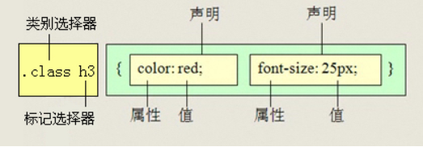

# 复合选择器

复合选择通过各种选择器的组合方式 更加准确和精准的命中目标元素

# 1. 后代选择器

后代选择器 又称为包含选择器，用来选择元素 或者 元素的后代。其写法就是把外层标签写在前面，内层标签写在后面 中间用 空格 分割 。当标签发生嵌套时，内层标签就会称为 外层标签的后代。



子代后代都可以选择 粗俗的说就是可以隔着辈分直接选择 也是 用的 最多的选择器


# 2. 子元素选择器

子元素选择器 只能选择作为 某元素 子元素的元素，其写法是把父级标签写在前面，子级标签写在后面 中间 用一个 > 进行连接 注意符号左右  两侧必须保留一个空格

也就是说 这里的子元素 指的是亲 儿子 而不包含 孙子 重孙子 之类的

```html
    <div class="deme">
        <div class="heha">
            <div class="zidai">我是儿子</div>
        </div>
    </div>
        .deme > .zidai {
            font-size: 20px;
            font-weight: 700;
        }
- 这个例子的运行结果是什么？结果是字体并没有发生任何变化
- 如果想要发生变化 需要去掉 大于 号 因为 加上了大于号 导致 元素 作用不过来
```

# 3. 交集选择器

交集选择器由两个选择器构成，找到的标签不许满足 既有标签一的特点，也有标签二的特点

```css
        p.one  {
            color: red;
        }
```

通过上面的方式就可以选择去 类名 为one 的p 标签 想多来说 用的少一点 因为太麻烦了

# 4. 并集选择器

并集选择器是各个选择器 通过 **逗号** 进行分割的，也就是 相同的标签都具备相同的样式就会用到并集选择器

# 5. 相邻选择器

选择器1 + 选择器 2 目的是为了精准的选择出 选择器 1后面的选择器2

# 6. 伪类选择器

伪类选择器 可以减少元素的命名 可以用来给某些选择器添加特殊效果，比如选择给某些连接添加效果 选择 第一个 第n 个元素 语法 使用 `:`

**a 链接的状态**

- l -> link   未访问
- v -> visited 已访问
- h -> hover 鼠标悬浮
- a -> active 选定的链接

**注意**

- 因为叫做链接伪类 所以使用的是交集选择器

**选择器的比较**

| 选择器     | 作用                        | 特征                       | 使用情况   | 实例       |
| ---------- | --------------------------- | -------------------------- | ---------- | ---------- |
| 后代选择器 | 选出子孙 元素               | 隔代选可以                 | 非常多     | ul lli a   |
| 子代选择器 | 为元素选出 儿子选择器       | 只能选亲儿子               | 较少       | .nav>.tab  |
| 交集选择器 | 交集部分                    | 伪类选择器类似             | 用不到几乎 | h3.classh3 |
| 并集选择器 | 用于 写出具备相同样式的元素 | 用，隔开，都具有相同的特征 | 非常多0    | p，h3 {}   |

