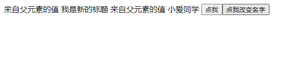

# 1. 修饰符 .sync 

其实这个 修饰符  和 v-model 指令 有点类似 都是  prop 属性 和事件的洁写形式


# 2. 原理

子组件 派发 `update:title` 事件 ，并且 将参数传递 给父组件

```html
   <button @click="$emit('update:title', newtitle)">点我</button>
```

接收父组件传递过来的 title 

```js
props:{
    title:String
}
```

父组件：其实这里还是父子组件 通信 并且传递参数

```html
 <sync-demo
      :title="doc.title"
      @update:title="doc.title = $event"
    ></sync-demo> 
```

绑定了一 title  并且 监听子组件的事件 并且接收 子组件 传递过来的参数 

# 3. 洁写

由于上面是父子通信改变值得写法事件的名称 写法 比较固定  所以

```html
    <sync-demo :title.sync="doc.title">

    </sync-demo> 
```


# 4. 扩展

我们也可以用同一个对象设置多个 prop 的值 需要注意的是 有几个 对象属性（你需要接收的）就写几个 prop 值然后依次来添加需要 触发改变值得事件的处理函数

可能说起来比较绕 看代码和 运行效果就好了

**父组件**

```html
    <sync-demo v-bind.sync="doc">

    </sync-demo>
```

这里绑定的 一个 对象 具备多个属性

```js
      doc:{
        title:"老人与海",
        name:'海明威'
      }
```

对象里面有两个属性 所以 prop  应该有两个  处理函数也应该有两个

**子组件** 

```js
  props: {
    title: {
      type: String,
    },
    name: {
      type: String,
    },
  },
```

```html
  <div>
    来自父元素的值 {{ title }} 来自父元素的值 {{ name }}
    <button @click="$emit('update:title', newtitle)">点我</button>
    <button @click="$emit('update:name', newName)">点我改变名字</button>
  </div>
```

这样就实现父组件和子组件之间数据的双向绑定

其实说白了就是 触发一个 规定的事件来更新一个属性的值而已

**展示效果**



初始化的值 老人与海和海明威  点击变成了上面的效果

