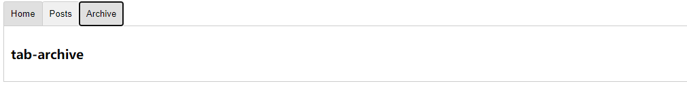

- 案例1

在 App.vue  父组件 中使用 动态引入的方式

```html
 <component v-for="(item,index) in compList" :is="item.path" :key="index" ></component>
```

```js
compList:[
      { id: "1", path: "component1", name: "组件1", ishow: true },
      { id: "2", path: "component2", name: "组件2", ishow: false },
      { id: "3", path: "component3", name: "组件3", ishow: true },
    ]
```

这样其实只是起到了一个把所有组件都引入进去 不能更好的诠释动态组件的意思 

但是  :is 的这种方式 只能适用于 动态组件的引入  直接引入会报错的 

```html
 <component :is="component4"></component>  
```

报错的信息如下所示

```js
  Property or method "component4" is not defined on the instance but referenced during render.
```

重点来看下官网的例子

```html

    <div id="dynamic-component-demo" class="demo">


      <button
        v-for="tab in tabs"
        :key="tab"
        :class="['tab-btn',{active:currentTab===tab}]"
        @click="currentTab=tab"
      >
        {{ tab }}

      </button>

      <component :is="currentTabName" class="tab" ></component>

    </div>
```


实现效果  点击 不同的按钮 显示不同的组件内容



首先 遍历 按钮的值

```js
  tabs:['Home','Posts','Archive']
```

当点击按钮的时候 

```js
 @click="currentTab=tab"
// 这里需要注意的是默认的 currentTab 的值 应该是 tabs 的第一项 而不应该是 ''
```

动态组件的引入

```js
currentTabName 使用 的是计算属性的方式去 绑定 组件的名称 currentTabName 应该和当前组件的名称相同
首先 观察组件的名称 TabHome TabPosts TabArchive

currentTabName:function(){
    
    return `Tab${this.currentTab}`
}

```

这样就实现了通过点击不同的按钮展示不同的组件的内容

扩展  vue 组件的命名规范

## 1. 单文件组件的大小写

### 1.1 **单文件组件** 的文件名 要么始终就是单词大写开头 ，要么始终是横线连接 

### 1.2 基础组件名字

应用特定样式和约定的基础组件  也就是展示类的 无逻辑 或者无状态的组件 应该全部 以一个特定的前缀开头 比如 base app v 

### 1.3 单例组件名 

只应该拥有单个活跃单例的组件 应该以 The 前缀命名，以表示其唯一性

这不是意味着组件只能用在单独的一个单页面 而是 每个也米阿女只使用一次。这些组件不接受任何的 prop ，因为他们是为你的应用定制的，而不是在你的应用中的上下文。如果你发现有必要添加 prop 这就表明这其实是一个可复用的组件 目前 在每个页面中只使用一次

### 1.4 组件中的单词顺序

组件名应该以较高级别的单词开头 以描述性的修饰词结尾 比如和 search 相关的组件 应该用 search 开头


