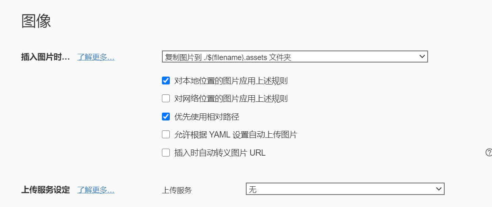

# markdown 教程

## 简介


学生时代我们是怎么学习的？都会有课本和板书，还有笔记。课本知识全面详细不清晰、重点不突出。板书相当于老师的笔记，但是我们的笔记可以来帮助我们梳理知识点，更加满足我们的需求，提高学习效率。


markdown 轻量级标记语言 工具使用Typora 文本编辑器


## 笔记的正确**定位**


+ 条理性
+ 符合个人需求
+ 有复习价值即可


## 使用（语法）说明


### 1. 多级标题

```md
# 一级
## 二级
### 三级
#### 四级
##### 五级
###### 六级
```

​      快捷键 

- ctrl+0 清空 标题格式
- ctrl1--ctrl6 一级到6级标题


### 2. 有序列表


1. 效果展示
    1. 介绍
        	1. 起源		
    2. 使用
    3. 技巧

2. 操作

   1. 编号 1加句号 后面跟上空格
   2. 行末回车序号自动增加
   3. 退出编号两次回车或者下箭头
   4. 降级 Tab 
   5. 升级 shift+tab

3. 快捷键 

   ctrl + shift + [

   

### 3. 无序列表


- 青菜
- 水果
  1. 哈哈哈
  2. 呵呵呵
  3. 呵呵呵


- 操作

  *号（+ - ）加 空格 

- 快捷键 Ctrl+shift+]


### 4. 任务列表

- [ ] 青菜
- [ ] 水果
- [ ] 呵呵呵
- [ ] 哈哈

语法 

```md
- [ ] 呵呵
```


### 5. 插入表格

|  姓名  | 学号 | 性别 | 年龄 |
| :----: | :--: | :--: | ---- |
| 史爱文 |  01  |  男  | 26   |
|        |      |      |      |

创建方式 

|姓名|学号|性别|年龄

快捷键 Ctrl+ t

### 6. 行内代码

`java` `C++`

### 7. 代码块

```js
function test () {}
```


### 8. 插入图片


### 9. 插入链接

[百度一下](www.baidu.com)

`[]()`


## Typora 配置

设置插入的图片到 本地的 asseets 下  这样给别人分享笔记的时候记得把图片文件夹一并发给人家 配置步骤如下

文件 -> 偏好设置

 

按照如下的配置方法 配置后  重启`Typora` 

## 友情链接


+ B 站 视频教程   [B 站 视频教程](https://www.bilibili.com/video/BV1hJ411X75X?from=search&seid=916792393353089160)
+ Typora  下载 [Download](https://www.typora.io/)


