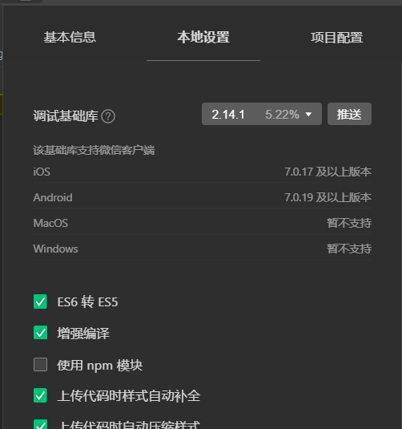

# 小程序开发错题本


微信小程序not been declared in app.json. 

```js

pages/index/main has not been declared in app.json.


Uncaught Error: APP-SERVICE-Engine:pages/index/main has not been declared in app.json.
    at new t (VM24 WAService.js:18)
    at Object.t.pageHolder [as Page] (VM24 WAService.js:17)
    at Et._initMP (vendor.js:1)
    at Et.$mount (vendor.js:1)
    at Object.MhDc (main.js:3)
    at t (manifest.js:1)
    at Object.global.webpackJsonpMpvue (manifest.js:1)
    at main.js:3
    at require (VM24 WAService.js:19)
    at <anonymous>:197:7


```


出现这个问题的原因就是 小程序的 调试基础库的版本不对 


选择用户占比最高的版本库就可以解决掉

2. connot read mark of undefined   出现这个问题的原因就是需要吧开发工具的增强编译选项选上

   

   ```js
   VM2940 WAService.js:2 TypeError: Cannot read property 'mark' of undefined
       at getUserTokenAndId (index.js? [sm]:45)
       at ge.onShow (index.js? [sm]:114)
       at ge.Page.obj.onShow (index.js? [sm]:110)
       at ge.<anonymous> (VM2940 WAService.js:2)
       at ge.c.__callPageLifeTime__ (VM2940 WAService.js:2)
       at Ge (VM2940 WAService.js:2)
       at VM2940 WAService.js:2
       at Te (VM2940 WAService.js:2)
       at Function.<anonymous> (VM2940 WAService.js:2)
       at i.<anonymous> (VM2940 WAService.js:2)
   ```

   

   这个问题的解决方案就是 把增强编译的选项勾选上

   

   