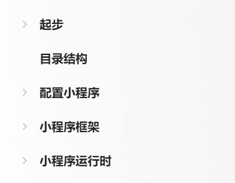
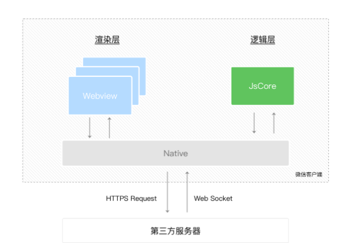

# 小程序理论知识基础

## 内容范围

## 起步

微信小程序在 **微信内** 便捷快捷地获取和传播，同时具有出色的用户体验。 

### 发展史

最开始使用原生的 js 方法 

当微信中的 **WebView** 逐渐成为移动 web 的一个重要入口时，微信就有相关的 JS API 了。比如调用原生组件的浏览图片的  JS API 相比额外引入一个图片预览的组件库，这种调用方式显得十分简洁和高效。

后来被外部的开发者逐渐使用 于是微信在2015年初发布了 一整套的网页开发工具包 JS-SDK 

刚开始微信官方是没有对外暴露过如此调用的，此类 API 最初是提供给腾讯内部一些业务使用，很多外部开发者发现之后也学着使用起来了，逐渐成为微信中网页的事实标准。**2015** 年初，微信发布了一整套网页开发工具包，称为 **JS-SDK,**开放了拍摄、录音、语音识别、二维码、地图、支付、分享、卡券等几十个 API。给所有的 web 开发者打开了一扇全新的窗户，让所有的开发者都可以使用到微信的原生能力，去完成之前做不到或者难以做到的事情。

JS-SDK 是对之前的 原生应用的包装 以及新能力的释放，并且由对内开放转为对所有的开发者开放，在很短的时间内获得了极大的关注，在数据监控来看，绝大部分在微信内传播的移动网页都使用到了相关的接口。

JS-SDK 的问题有明显的白屏问题 于是有了 增强版 其中还有一个重要的功能  称之为web 资源离线存储

JS-SDK 解决了移动网页能力不足的问题，通过暴露微信的接口使得  Web 开发者能够拥有更多的能力，然而在更多的能力之外，JS-SDK 的模式并没有解决使用移动端网页遇到的体验不良的问题。用户在放问网页的时候，浏览器在显示之前会有白屏的过程，但是在移动端受限于设备的性能和网速，白屏的问题会更加明显，于是有了 JS-SDK 的增强版本，其中有一个重要的功能，称之为 **'微信 Web 资源离线存储'**。

> 微信 web 资源离线存储 是面向 web 开发者 提供基于微信的 web 加速方案。
>
> 使用微信的离线存储，web 开发者可以借助微信提供的资源存储能力，可以直接从微信本地加载 web 资源，而不需要再从服务端拉取，从而减少网页加载时间，为微信用户提供更优质的网页浏览体验。为每个公众号下 所有 Web App 累计最多可缓存 5M 的资源

虽然减少了网页加载时间，但是一些复杂的页面依然会有白屏问题，页面加载了大量的 CSS 或者 JS  文件 。除了白屏，影响 Web 体验问题还有缺少操作反馈的问题，主要表现在两个方面，页面切换生硬和点击延迟。

微信面临的问题就是如何设计一个比较好的系统，使得所有的开发者在微信中都获得比较好的体验。在这个问题之前是 JS-SDK 解决不了的，它需要使得所欲的开发者都能够做到

- 快速的加载‘
- 更强大女的能力
- 原生的体验
- 易用且安全的微信数据开放
- 高效和简单的开发

这就是小程序的由来

## 微信小程序和普通网页版的区别

小程序在在三大运行环境中运行的区别

| 运行环境         | 逻辑层         | 渲染层           |
| ---------------- | -------------- | ---------------- |
| ios              | JavaScriptCore | WKWebView        |
| 0安卓            | v8             | chromium定制内核 |
| 小程序开发者工具 | NWJS           | Chrome WebView   |

网页开发者可以使用到各种浏览器暴露的dom api 进行 dom 选中 和操作 但是小程序 的逻辑层和渲染层是分开的。逻辑层 运行在 jscore中 并没有完整的浏览器对象 因此缺少相关的dom API 和 bom api 这导致前端开发非常熟悉的一些库 如 jQuery、Zepto等，在小程序中是无法运行的。同时 jsCore 的环境同 nodeJs 的环境也是不尽相同，所以现在一些 npm 包早小程序中也是无法运行的。

接下来介绍一下小程序的渲染层和逻辑层

wxml和wxss工作在渲染层，js脚本工作在逻辑层，逻辑层采用jsCore 线程运行 js 脚本。一个小程序的渲染层和逻辑层分别由两个线程管理 渲染层界面使用了webView进行渲染。一个小程序存在多个界面 所以会存在多个webview 线程，这两个线程的通信会经由微信客户端（Native） 做中转，逻辑层发送网络请求也经由native 转发，小程序的通信模型如下图所示

## 小程序配置

全局配置 小程序的全局配置 是通过 小程序根目录下的 app.js 文件进行配置的

每一个配置项的属性都是一个对象

window 配置项说明 用于设置小程的状态栏、导航条、标题、窗口背景颜色

- navigationBarBackgroundColor 导航栏背景颜色

- navigationBarTextStyle 导航栏标题颜色

- navigationBarTitleText  导航栏文字内容

- backgroundColor 这是指的小程序开启下拉刷新的时候 导航栏下面区域的颜色

- backgroundTextStyle 下拉刷新的时候 加载 的loading 效果样式

- enablePullDownRefresh 开启下拉刷新 

- onReachBottomDistance 触底事件

  配置也可以通过这种方式去记

  

tabbar 的配置

鉴于小程序中也可以自定义配置 但是自定义的导航栏 其实最重要的还是样式的书写 和点击实现页面的跳转

现在以我们的项目为例 封装 components-tabbar 组件 并且在项目中使用

