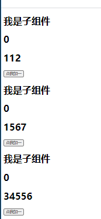

# 1. vue 组件


## 1.1 组件基础


由于在实际开发的过程中采用的都是 `webpack + babel`  的形式或者使用`vue-cli`的形式创建的 所以举例子的时候采用的都是实际开发中的小例子


1. App.vue

   - 组件注册

     ```js
      Son from './components/Son.vue'
       components: {
           Son
         },
     ```

   - 组件使用

     ```html
     <template>
         <div>
           <son></son>
           <!-- <son></son>
           <son></son> -->
         </div>
     </template>
     
     ```

   2. son.vue

      ```html
      <template>
          <div>
              <h1>
                  我是子组件
              </h1>
              <h1>
                  {{ count }}
              </h1>
              <button @click="count++">点我加一</button>
              
          </div>
      </template>
      ```

      ```js
          data() {
              return {
                  count:0
              };
          },
      ```

   3. 效果展示

      

      


## 1.2 组件复用


1. 组件可以进行任意次数的复用

```html
<template>
    <div>
      <son></son>
      <son></son>
      <son></son>
    </div>
</template>
```

2. 效果展示

   

3. 注意点击按钮时，每个组件都会被各自维护 自己的 `conut`。因为每用一次组件，就会有一个它的新`实例`被创建

4. 组件的内部`data` 必须是一个函数 这里另外在开启一篇文章。

   `vue基础/data是函数的原因.md`

## 1.3 prop 应用


###  1.3.1 基础父子传值

APP.vue

```html
 <son :sondata="112"></son>
```

Son.vue

```js
    props: {
        sondata:{
            type:Number
        }
    },
```

```html
        <h1>
            {{ sondata }}
        </h1>
```

这样就可以在组件中访问父组件 App.vue 传递过来的数据了

一个组件默认可以拥有任意数量的 prop 任何值都可以传递给任何 prop 在上述模板中，我们能够在组件实例中访问这个值 就像 访问 `data` 中的值一样。

```html
<template>
    <div>
      <son :sondata="112"></son>
      <son :sondata="1567"></son>
      <son :sondata="34556"></son>
    </div>
</template>
```


```js
        sondata:{
            type:Number
        }
```


展示效果




然而在实际开发的过程中数据极有可能是数组或者对象 渲染的时候可以使用 v-for 进行渲染。

刚刚在这个地方竟然卡住了，应该在子组件中去接收父组件 传递过去的。 但是这种写法有个弊端就是当需要绑定很多的属性的时候就不能定义很多 props 因为太麻烦了，解决方案在下节。也有官网的例子，也有自己的代码。

APP.vue

```vue
<template>
  <div>
    <son 
     v-for="post in demoData"
     v-bind:key="post.id"
     v-bind:title="post.title"
     :sondata="demoData"
    >
  
    </son>
  </div>
</template>

      demoData: [
        { id: 1, title: "My journey with Vue" },
        { id: 2, title: "Blogging with Vue" },
        { id: 3, title: "Why Vue is so fun" },
      ]
```


Son.vue

```vue
      <h1>
            {{ title }}
      </h1>

    props: {
        sondata:{
            type:Array
        },
        title:{
            type:String
        },
        key:{
            type:Number
        }
    }
```


效果展示


### 1.3.1 单个根元素

当构建一个组件的时候 你模板中插入的内容肯定远远不止一个标题


```vue
<h1>
    {{ title }}
</h1>


```


肯定还有标题什么的内容

```html
<h1>
    {{ title }}
</h1>
<div v-html="content">
    
</div>
```

但是 vue 语法规定的是每个组件必须只有一个根元素，可以将模板的内容包裹在一个父元素内来修复这个问题 

```vue
<div>
        <h1>
            {{ title }}
        </h1>
        <div v-html="content">

        </div>
</div>
```


当组件越来越复杂的时候，传递的数据越来越多的时候，为每一个相关的数据都定义一个 prop 会变得很麻烦。

```html
<blog-post
  v-for="post in posts"
  v-bind:key="post.id"
  v-bind:title="post.title"
  v-bind:content="post.content"
  v-bind:publishedAt="post.publishedAt"
  v-bind:comments="post.comments"
></blog-post>
```


现在应该把这写属性都放在一个对象里面 ，让它变成一个 单独的对象 作为 prop


```html
<blog-post
  v-for="post in posts"
  v-bind:key="post.id"
  :post="post"

></blog-post>
```


在子组件接收的时候

```js
props:{
    post:Object
}
```


在刚才的例子中使用的多个 prop 现在使用单个prop  

App.vue

```html
<template>
  <div>
    <son
      v-for="post in demoData"
      v-bind:key="post.id"
      :post="post"
    >
    </son>
  </div>
</template>
```

## 1.4 监听子组件事件-通过子组件的分发的事件改变父组件的值

在我们的开发的过程中，一些组件的功能可能要求和我们的父级组件进行沟通。例如我们可以引入一个辅助功能来放大博文的字号，同时让页面的其他部分保持默认的字号 

在其 **父组件** 中，通过添加一个 `postFontSize` 数据 property 来支持 这个功能

**App.vue**

```html
      <event v-for="post in posts" :key="post.id" :post="post" @enlarge-text="enLarge" :style="{fontSize:postFontSize + 'em'}"> </event>

```

```js
import Event from "./components/Event.vue";
  components: {
    // Son,
    Event, 
  },
   data() {
    return {
      posts: [
        { id: 1, title: "My journey with Vue",content:'hehehhe' },
        { id: 2, title: "Blogging with Vue"  ,content:'hehehhe'},
        { id: 3, title: "Why Vue is so fun"  ,content:'hehehhe'},
      ],
      postFontSize: 1,
    };
  },
```

定义了数据 并且在模板中使用一下 

注意 `:style="{fontSize:postFontSize + 'em'}"` 中的 ：是必须有的

在子组件中 想要 改变 父组件中 `postFontSize` 中的值 需要在 子组件 中 调用内建的 `$emit` 方法 并传入事件名称 来触发一个事件

**Son.vue**

```html
<template>
    <div>
        <h1>{{ post.title }}</h1>
        <div v-html="post.content"></div>
        <button @click="$emit('enlarge-text')">变大</button>
    </div>
</template>
```


父组件里面需要添加`enlarge-text` 监听器 就会接收改事件 并且更新  postFontSize 的值，并且在父组件里面定义处理 `enlarge-text` 的函数

```js
   enLarge(){
      console.log('打印事件触发了', );
      this.postFontSize += 0.1
      console.log('打印', this.postFontSize);
       
    }
```


通过上面的步骤就做到了在子组件里面改变父组件的值 


效果展示


# 2. vue 组件通信

